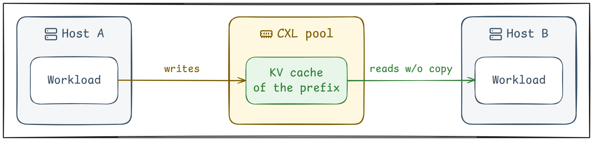
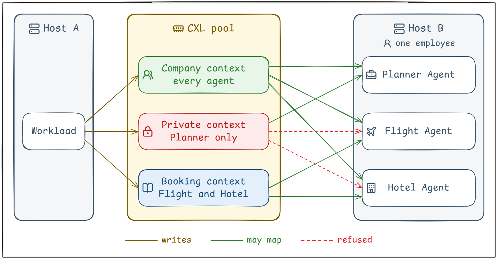
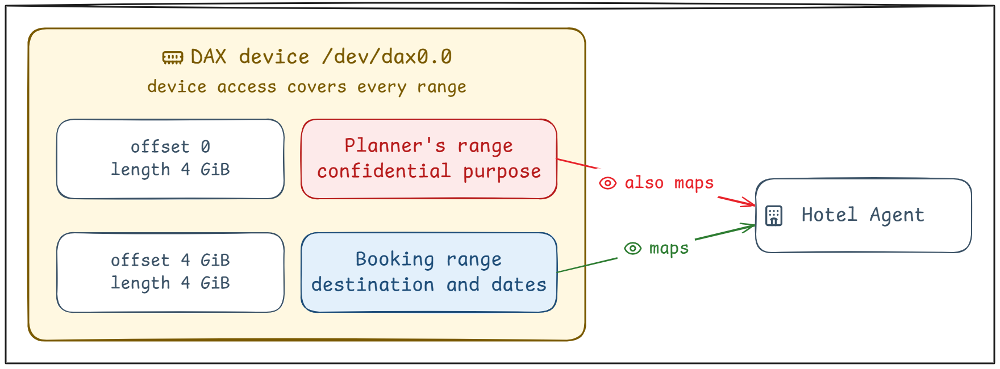
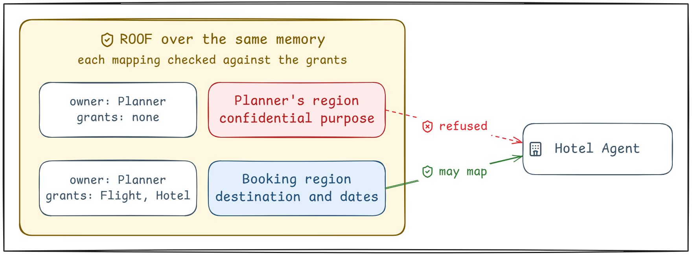

# Who Gets to Reuse Your KV Cache in the CXL Pool?

*Part 1 of 2: why a shared CXL memory pool needs permissions for each context and workload.*

Our earlier [Maru work](https://medium.com/xcena-blog/how-we-solved-the-kv-cache-bottleneck-in-llm-inference-with-cxl-shared-memory-d5133dcfb044) kept reusable KV caches in CXL shared memory.<br>
Any inference host could read them there, without a copy.

A workload on Host A has already processed a prefix.<br>
It has stored the resulting KV cache in the CXL pool.<br>
A workload on Host B is ready to reuse it.



**An address tells us where the KV cache is.**<br>
**It does not tell us who may use them.**

Now run a company assistant on hosts that share the CXL pool.

## One Assistant, Different Contexts

*On what basis should one assistant divide its KV caches?*

Employees ask about company policies, product documentation, and their projects.<br>
Requests run on whichever inference worker has capacity.

Much of the input repeats.<br>
The same application instructions.<br>
The same handbook.<br>
The same product reference.

But the assistant also retrieves restricted project documents.<br>
It keeps private conversations too.<br>
Those have different audiences.

- **Company handbook:** all employees using the assistant.
- **Restricted project context:** requests authorized for that project.
- **Private conversation:** workloads authorized for that employee's session.

Give every employee a separate cache, and we repeat the shared work.<br>
Give everyone one shared cache, and we expose private context.

**The sharing scope belongs to the context.**

Company context for the company.<br>
Project context for the project.<br>
Private context for that employee's session.

So each context needs its own region of the pool.<br>
Each region admits only its audience.

## One User, Different Workloads

*Who should a permission name when one user runs different workloads?*

An employee asks an assistant to book a business trip.<br>
The assistant's Planner Agent knows why the trip matters.<br>
It delegates tasks to a Flight Agent and a Hotel Agent.

The Flight Agent needs the route and dates.<br>
The Hotel Agent needs the destination and dates.<br>
Neither needs the confidential business purpose.

One employee.<br>
Different permissions.

Prefix caching reuses KV cache only for a shared prefix.<br>
The assistant's KV caches therefore form a prefix tree:

```text
Company context = handbook + travel policy + expense policy
├─ Planner private context = confidential business purpose
└─ Booking context = destination + dates + budget + preferences
    ├─ Flight booking context
    └─ Hotel booking context
```

Every agent shares the root.<br>
The booking contexts never include the confidential purpose.

**So each workload needs its own permissions.**

Put the two scenarios together.<br>
The unit of access control is the context.<br>
The subject of access control is the workload.



We wanted KV cache reuse to respect each context's permissions for every workload, on every host.

## Access Without Control

*What is still missing from raw access to the pool?*

[Device DAX](https://github.com/cxl-micron-reskit/famfs#what-is-dax), or devdax, is the common way to access shared CXL memory.<br>
In a direct devdax setup, a worker opens a DAX device and maps a range.<br>
An offset says where it starts.<br>
A length says how much to map.

Linux controls access to the device.<br>
It does not control which range a process maps inside it.

Put the travel assistant's KV caches on one DAX device.<br>
An allocator gives the Planner's private context one range and the booking context another.<br>
The Hotel Agent needs access to the device to read the booking context.<br>
That access also lets it map the Planner's range and read the confidential purpose.



The same gap crosses hosts.<br>
Every host accesses the CXL pool through its own DAX device.<br>
On any of them, access to that device includes the Planner's range.<br>
Each host controls that access only by its own local accounts, not by workload identity.

**We had a way to access shared memory.**<br>
**We still needed a way to control who may use it.**

## Needed: Access With Control

*What does access with control require?*

Some requirements come straight from the scenarios above.

- **Region with an owner.**<br>
  Each region needs an explicit boundary and explicit rights.<br>
  Someone has to set each region's audience.<br>
  That is its owner.<br>
  Only the owner decides who else may use the region.
- **Identity every host can verify.**<br>
  Every host must recognize the same workload by the same identity.<br>
  A local account number cannot do that.<br>
  A workload here means one process,
  because one account can run several of them.
- **Check that workloads cannot bypass.**<br>
  The check must happen where a workload maps the memory.<br>
  If the workload can still open the raw device, it can bypass the check.

Others come from what any safe design needs.

- **Region that outlives its creator.**<br>
  The workload on Host A may exit,
  but the workload on Host B still needs that KV cache.<br>
  The region has to stay until nothing uses it.
- **No permission outlives the process that received it.**<br>
  The Flight Agent's read permission belongs to that one running process.<br>
  When the Flight Agent exits, the permission must disappear with it.<br>
  Otherwise a new process could be mistaken for the Flight Agent.

The device exposes the memory.<br>
**It needs a roof over it, one that controls the sharing.**

## A ROOF Over Shared Memory

We are building ROOF (Region Ownership Over Fabric) to meet those requirements.<br>
It is a multi-host filesystem for the CXL pool, with cross-host identity and access control.

Like any filesystem, ROOF lets applications name a region, open it, and map it.<br>
Unlike a plain filesystem, it also attaches an owner and grants to each region.<br>
ROOF keeps those records in the pool itself,
so every host reads the same ones.<br>
On every host, ROOF's kernel module checks each mapping against those grants.



[Part 2](medium_draft_part2.md) takes up these questions:

- Why is a filesystem the natural place for these regions?
- What does [famfs](https://github.com/cxl-micron-reskit/famfs), an existing filesystem for the CXL pool, already solve?
- What do our workloads need that famfs does not give?
- Why build ROOF, a new filesystem?
- What does ROOF cover, and what does it not cover yet?

Return to the scene we started with.

> A workload on Host A has already processed a prefix.<br>
> It has stored the resulting KV cache in the CXL pool.<br>
> A workload on Host B is ready to reuse it.

May this workload use it?

**ROOF answers that the same way on every host.**

---

ROOF: [github.com/xcena-dev/roof](https://github.com/xcena-dev/roof)

Icons: [Lucide](https://lucide.dev) under the [ISC License](https://lucide.dev/license)

### Suggested tags

`CXL` · `KV Cache` · `Filesystem` · `Access Control` · `Shared Memory`
