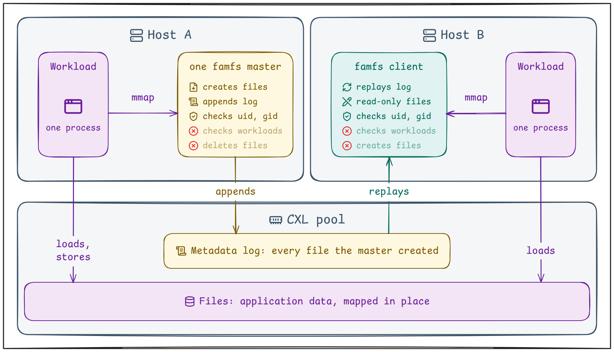
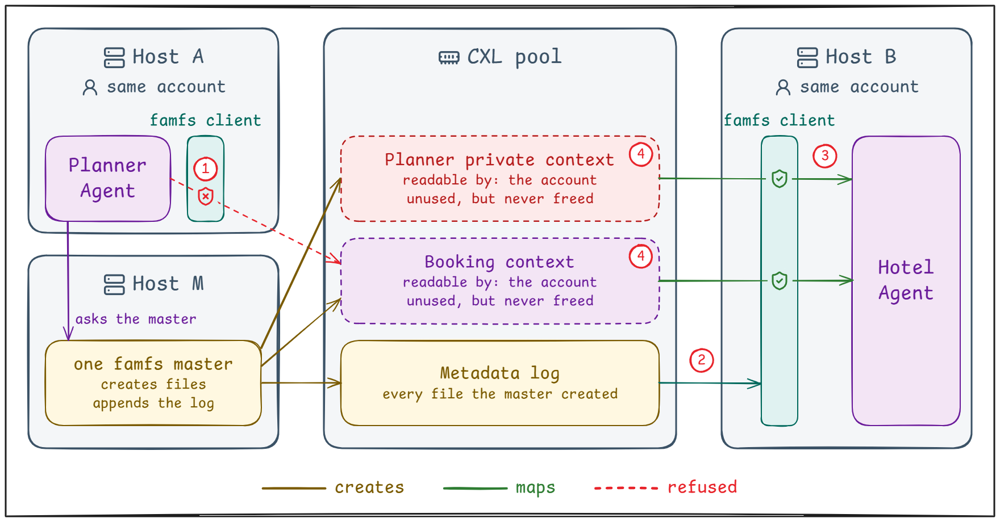
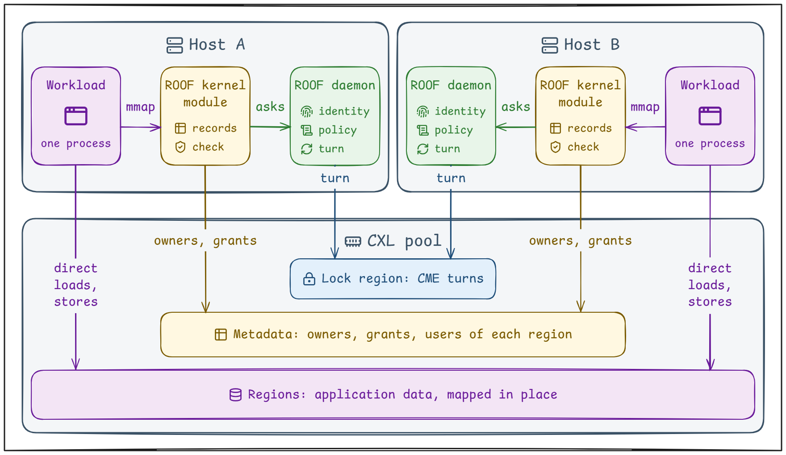
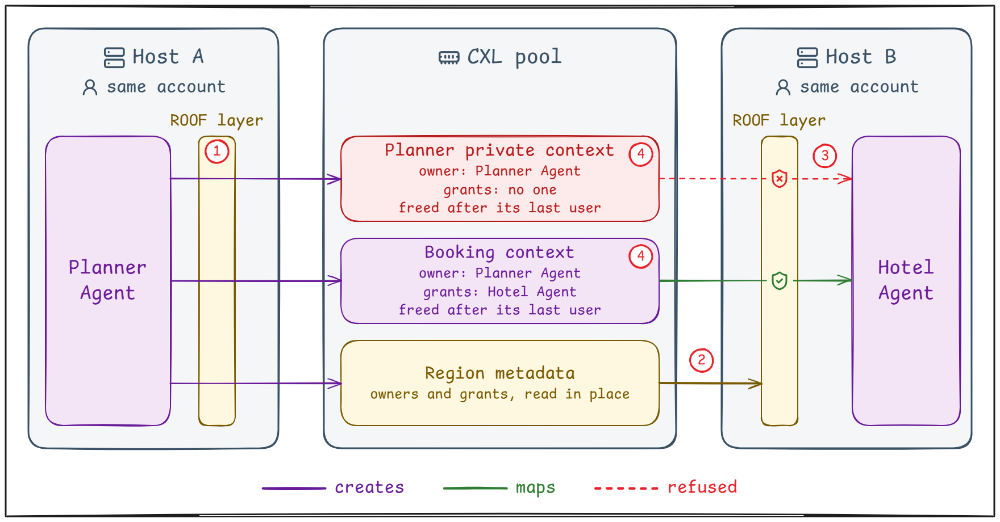

# A ROOF over the CXL Pool

*Part 2 of 2: how ROOF combines region ownership, workload grants, and reclamation across hosts.*

[Part 1](medium_draft_part1.md) started and ended with this scene:

> A workload on Host A has already processed a prefix. 
> It has stored the resulting KV cache in the CXL pool. 
> A workload on Host B is ready to reuse it.
>
> May this workload use it?

As Part 1 showed, the answer depends on the context and the workload. 
In Part 1's travel assistant, the Hotel Agent may reuse the booking context. 
It may not read the Planner's private context. 
Each context needs its own region. 
Each workload needs its own permissions. 
And the answer must be the same on every host.

A filesystem was the natural choice for those regions, 
because filesystems already provide what a region needs:

- **Namespace.** A workload finds a region by name, not by device offset.
- **Space allocation.** The filesystem gives each region its range of the pool.
- **Access control.** The kernel checks access to each region, not just to the whole device.
- **Region lifecycle.** A region lives from its creation to its deletion. 
  The region's space stays while any process still has it open or mapped.

There was already a filesystem for the CXL pool:
[famfs](https://github.com/cxl-micron-reskit/famfs).

**So why build another?**

## Famfs: Built for Sharing

*What does famfs already solve?*

Famfs makes the CXL pool accessible through files. 
An application maps a file and uses its data in place. 
Workloads on several hosts map the same copy of the data.

**Famfs already brings several of those basics to the CXL pool.**

- **Namespace.** Each file has a name,
  so a workload finds data by name.
- **Space allocation.** Famfs gives each file its range of the pool.
- **Access control.** Files carry ordinary POSIX permissions.
- **Region lifecycle, in part.** Files can be created and mapped,
  but not deleted.

We needed those basics. 
But we needed answers to more questions. 
Famfs answers them with its design:

- **Who creates a region, and who owns it?** 
  Only the master host creates files. 
  Each file belongs to a uid and gid.
- **When do other hosts see it?** Only after they replay the master's metadata log.
- **Who may use it, on every host?** 
  Each host checks access by uid and gid.
- **How long do the region and each permission last?** 
  Individual files cannot be deleted to reclaim their space. 
  A permission does not end when a process exits.

## Famfs: Not Built for Workload Control

*What do our workloads need that famfs does not give?*

Replay the scene from Part 1 on famfs, with the travel assistant. 
The Planner Agent runs on Host A, and the Hotel Agent runs on Host B. 
Both run under the same employee's account.

1. **The Planner Agent on Host A stores its KV caches.** 
   In famfs, only the master host creates files. 
   The Planner Agent must ask the master to create them on its behalf.
2. **The Hotel Agent on Host B reads the booking context in place.** 
   Host B sees the new file only after it replays the master's metadata log.
3. **The Hotel Agent tries to read the Planner's private context.** 
   Famfs checks only the account both agents share. 
   So the Hotel Agent gets in.
4. **The trip is booked, and no workload needs the caches.** 
   Famfs cannot delete a single file. 
   So the regions' space never returns to the pool.

**So we needed owners, workload grants, and lifetimes that every host shares.**

## ROOF: Built for Workload Control

*Why build ROOF, a new filesystem?*

We could have added these to famfs. 
But doing so changes famfs's answers to all four questions above. 
That would leave little of the original design.

We chose to build all of them together in ROOF (Region Ownership Over Fabric).

ROOF keeps one copy of its metadata in the CXL pool. 
Our earlier [CME work](https://medium.com/xcena-blog/cxl-gave-us-shared-memory-it-did-not-give-us-a-mutex-514b9cb025b3) decides whose turn it is to change it. 
Each of the four questions has its answer in this design:

- **Who creates a region, and who owns it?** 
  A workload on any host can create a region. 
  After its host takes a CME turn, the workload creates the region and owns it.
- **When do other hosts see it?** Once the creating host publishes the region's metadata in the pool. 
  Every host reads it in place, never from a stale cache line.
- **Who may use it, on every host?** 
  The owner grants each region to the workloads it chooses, not to accounts. 
  Each host's kernel module checks every mapping against the region's grants. 
  So every host reads the same answer from the pool.
- **How long do the region and each permission last?** 
  Each grant ends with its process. 
  ROOF reclaims the region after its last user, including the owner, is gone.

**In ROOF, workload control is part of the filesystem.**

## ROOF: Sharing With Control

*What does ROOF cover?*

Replay the same scene on ROOF.

1. **The Planner Agent on Host A stores its KV caches.** 
   The Planner Agent creates the regions itself and owns them. 
   It grants the booking context to the Hotel Agent and the private context to no one.
2. **The Hotel Agent on Host B reads the booking context in place.** 
   Host B sees the region as soon as Host A writes its metadata. 
   ROOF checks the Hotel Agent's grant before the kernel maps the region.
3. **The Hotel Agent tries to read the Planner's private context.** 
   Both agents run under one account. 
   But no grant names the Hotel Agent for this context. 
   So ROOF refuses it.
4. **The trip is booked, and no workload needs the caches.** 
   When the Planner Agent exits, ROOF reclaims its private context. 
   When the Hotel Agent exits, ROOF reclaims the booking context too.

**Owners, workload grants, and lifetimes now hold on every host.**

## ROOF: Control With Limits

*What does ROOF not cover yet?*

ROOF is experimental. 
These limits remain:

- **Trust.** ROOF trusts the kernel and the administrators on every host. 
  Workloads must not open the raw DAX device themselves.
- **Identity granularity.** ROOF tells workloads apart by process. 
  Two agents inside one process share its permissions.
- **Region lifetime.** ROOF reclaims a region after its last user, including the owner, is gone. 
  A later reader cannot find it.
- **Region size.** A region is sized once and cannot grow or shrink.
- **Revocation.** ROOF cannot take back a grant yet. 
  We still have to define what it stops. 
  It could stop new mappings, a mapping already in place, or both.

## Back to the First Question

Part 2 started with this scene:

> A workload on Host A has already processed a prefix. 
> It has stored the resulting KV cache in the CXL pool. 
> A workload on Host B is ready to reuse it.
>
> May this workload use it?

On ROOF, the answer depends on the workload itself. 
ROOF on Host B checks the workload against the grants the cache's owner wrote into the pool. 
Every host reads those grants and reaches the same answer.

The memory stays shared. 
The permission to use each region stays specific to each workload.

**That is why we built ROOF.**

ROOF is open source on [GitHub](https://github.com/xcena-dev/roof). 
The [design document](https://github.com/xcena-dev/roof/blob/main/docs/design.md) explains how it works. 
The [security report](https://github.com/xcena-dev/roof/blob/main/docs/security_report.md) lists the attackers it assumes and what it defends against.

---

Icons: [Lucide](https://lucide.dev) under the [ISC License](https://lucide.dev/license)

### Suggested tags

`CXL` · `KV Cache` · `Filesystem` · `Access Control` · `Shared Memory`
